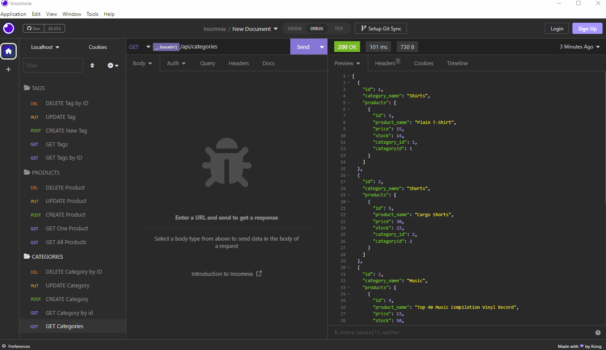

# ORM-E-Commerce-Back-End

## Table of Content
- [Description](#description)
- [Links](#links)
- [Screenshots](#screenshots)
- [Installation](#installation)
- [Test](#test)

------------------------------
## Description
A starter code was provided to build the back end for an e-commerce website. This app uses environment variables to store sensitive data and uses the schema.sql file to create a database using MySQL shell commands. The database is seeded from command line using "node seeds/index.js" command. The routes will perform CREATE, READ, UPDATE and DELETE operations using sequelize models. The data for each of these routes are displayed in a formatted JSON.  

------------------------------
## Links
Walkthrough video => https://drive.google.com/file/d/1I11D7mQecjWh5GSRfLfeabzyxpbSO7EU/view

## Screenshots

------------------------------
## Installation

    ​npm install    ​
   
## Test 

    node server.js
   
-----------------------------------------
&copy; 2023